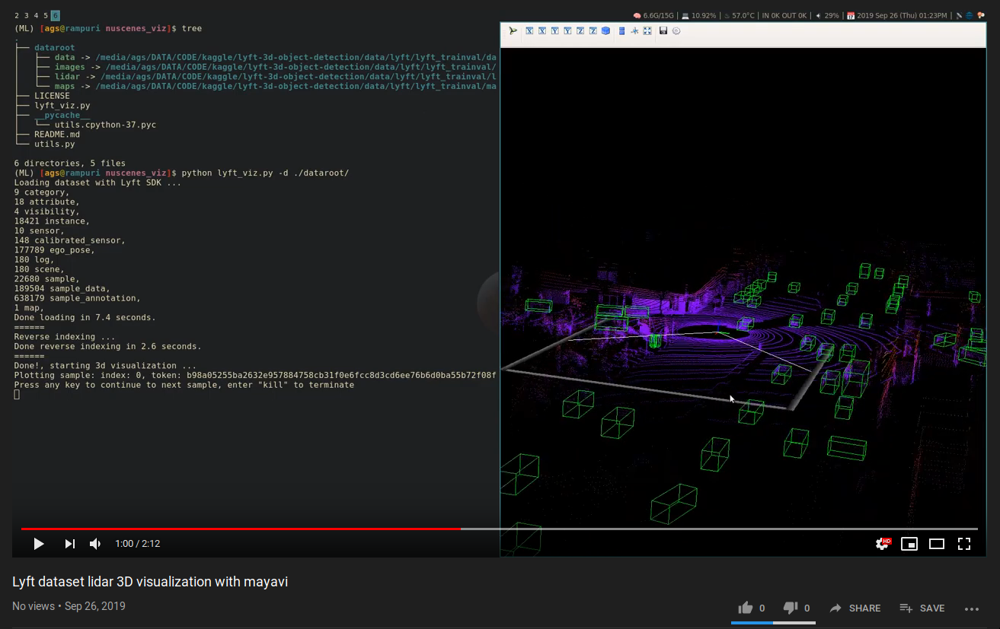

# NuScenes Visualization tool

This is [mayavi](https://github.com/enthought/mayavi) based 3D visualization tool for NuScenes dataset. As of now, it supports lyft's level 5 dataset, I'll extend support for actual nuscenes dataset later on.

## Demo

The demo video is of the older version of this tool, some functionalities have changed since then.

[](https://www.youtube.com/watch?v=ivmiN4zvRTo)

## Requirements

* mayavi (follow installation instructions from [here](https://github.com/enthought/mayavi#installation)
* [lyft dataset SDK](https://github.com/lyft/nuscenes-devkit/)


## Instructions

### lyft level 5 dataset visualization

#### Required data directory structure

This tool uses lyft dataset sdk, which expects data root directory in the following format:

```
    dataroot/
        - images/
        - lidar/
        - maps/
        - data/          <----- contains json files
```

if you don't want to rename the given directories, use softlinks like this:

```
mkdir dataroot
ln -s /full_path_to_original_root_directory/train_images dataroot/images
ln -s /full_path_to_original_root_directory/train_lidar dataroot/lidar
ln -s /full_path_to_original_root_directory/train_maps dataroot/maps
ln -s /full_path_to_original_root_directory/train_data dataroot/data
```

Once you have the required directory structure present in `dataroot` folder, we are ready to visualize our dataset.

### let's run the visualization script


* To plot samples of a scene one by one, we need scene token:

```
python lyft_viz.py -d ./dataroot/ --scene da4ed9e02f64c544f4f1f10c6738216dcb0e6b0d50952e158e5589854af9f100
```

* To plot a specific sample, use the sample token as:

```
python lyft_viz.py -d ./dataroot/ --sample 24b0962e44420e6322de3f25d9e4e5cc3c7a348ec00bfa69db21517e4ca92cc8
```


## References

* https://github.com/hengck23/didi-udacity-2017
* https://github.com/kuixu/kitti_object_vis
* https://github.com/enthought/mayavi#installation
* https://github.com/lyft/nuscenes-devkit/
